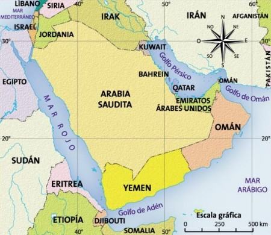

---

title: "Islamismo"
author: "Maria Eduarda"
date: "`r Sys.Date()`"
output: revealjs::revealjs_presentation
---

```{r setup, include=FALSE}
options(htmltools.dir.version = FALSE)

knitr::opts_chunk$set(echo = TRUE)

setwd("C:/Users/tarss/Desktop/Duda")
library(dplyr)
library(stringr)
library(gutenbergr)
library(tidytext)
library("RColorBrewer")
library("wordcloud")


```
#Peninsula Arabica

- É banhada pelo Mar Vermelho, Golfo Pérsico e Oceano Índico.

- Grande parte de seu terrítorio é desértico,sendo encontrados algumas áreas férteis chamadas óasis.

- Seus primeiros habitantes eram chamados de beduínos,que viviam em tribos nomades e em constantes combates para a conquista dos oásis que lhes proporcionava água e terra fértil para o plantio.

---
#Península Arábica

```{r echo=FALSE, out.height= "450px"}



```

---

#Pilares do Islamismo

- Fé: reconhecer Alá como seu Deus e Maomé como seu profeta

- Oração: rezar cinco vezes ao dia sempre em direção a Meca

- Jejum: jejuar no mês do Ramadã 

- Caridade: dar esmoalas aos mais necessitados na intenção de divulgar a religião

- Peregrinação: ir a Meca pelo menos uma vez na vida caso tenha condições físicas ou financeiras.

---

#Alcorão

- Alcorão ou Corão significa "A Recitação".

- Esse livro é considerado sagrado para a religião islamica,é nele onde contém orientações para a vida dos fiéis.

---

#Alcorão

##Baixar o livro

```{r echo=TRUE, message=FALSE}

alcorao <- gutenberg_download(2800)

head(alcorao)

```

---

#Alcorão

##Transformar livros em palavras

```{r echo=TRUE, message=FALSE}

palavras <- alcorao %>% 
  unnest_tokens(word,text)

head(palavras)

```

---

#Alcorão

##Contar palavras

```{r echo=TRUE, message=FALSE}

contar <- palavras %>% 
  count(word , sort = TRUE)

head(contar,n=10)

```
---

#Alcorão

##Contar palavras

```{r echo=TRUE, message=FALSE, error = FALSE, warning= FALSE}

stop <-  data.frame(
  word = c("ye", "hath", 
            "thou", "thee", 
           "thy","1", "sura",
           "2","3","4","5","6","7",
           "8","9"))
 
contar <- palavras %>% 
  count(word , sort = TRUE) %>% 
  anti_join(stop_words) %>% 
  anti_join(stop)


```
---
#Alcorão

##Contar palavras

```{r echo=FALSE, message=FALSE, error= FALSE, warning= FALSE}

stop <-  data.frame(
  word = c("ye", "hath", 
            "thou", "thee", 
           "thy","1", "sura",
           "2","3","4","5","6","7",
           "8","9"))
 
contar <- palavras %>% 
  count(word , sort = TRUE) %>% 
  anti_join(stop_words) %>% 
  anti_join(stop)

head(contar, n= 20)

```
---

#Alcorão

##Wordcloud

```{r echo=TRUE,eval=FALSE}

wordcloud(words = contar$word, freq = contar$n, min.freq = 1,
          max.words=200, random.order=FALSE, rot.per=0.35, 
          colors=brewer.pal(8, "Dark2"))

```

---

#Wordcloud

```{r echo=FALSE,eval=TRUE, out.height= "500%"}

wordcloud(words = contar$word, freq = contar$n, min.freq = 1,
          max.words=70, random.order=FALSE, 
          colors=brewer.pal(8, "Dark2"),c(10,1))

```